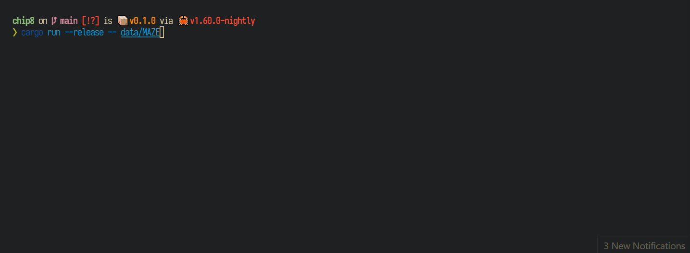

# chip8

A rust, terminal ui chip8 emulator with debug information.



## Usage

```bash
git clone git@github.com/mcountryman/chip8.git
cd chip8

# To start the emulator
cargo run --release -- /path/to/game.ch8

# To start the emulator in a paused state
cargo run --release -- /path/to/game.ch8 --is-paused=true
```

## Shortcuts

While running the following keyboard shortcuts will be available:

- `space` - Pause/unpause the virtual machine.
- `enter` - Steps virtual machine to the next instruction.
- `esc` - Exit the virtual machine.
- `ctrl + c` - Exit the virtual machine.
- `q` - Sends `0xa` key to the virtual machine.
- `w` - Sends `0xb` key to the virtual machine.
- `e` - Sends `0xc` key to the virtual machine.
- `a` - Sends `0xd` key to the virtual machine.
- `s` - Sends `0xe` key to the virtual machine.
- `d` - Sends `0xf` key to the virtual machine.
- `0` - Sends `0x0` key to the virtual machine.
- `1` - Sends `0x1` key to the virtual machine.
- `2` - Sends `0x2` key to the virtual machine.
- `3` - Sends `0x3` key to the virtual machine.
- `4` - Sends `0x4` key to the virtual machine.
- `5` - Sends `0x5` key to the virtual machine.
- `6` - Sends `0x6` key to the virtual machine.
- `7` - Sends `0x7` key to the virtual machine.
- `8` - Sends `0x8` key to the virtual machine.
- `9` - Sends `0x9` key to the virtual machine.

## Features

- Small video memory
  > Utilizes a stack allocated array of `u64` where each bit in `u64` represents a pixel.
- Debug interface.
  > Displays the virtual machine register values, stack values, and disassembly.
- Responsive interface.
  > Game window can be displayed in three different resolutions using three character sets: [braille](https://en.wikipedia.org/wiki/Braille_Patterns), [quarter block](https://en.wikipedia.org/wiki/Block_Elements) and full block characters.

## Credits

- [cowgod](http://devernay.free.fr/hacks/chip8/C8TECH10.HTM) Provided documentation of chip8 instructions and architecture.
- [starrhorne](https://github.com/starrhorne/chip8-rust) Provided references for instruction execution, and ideas for parsing instructions.
